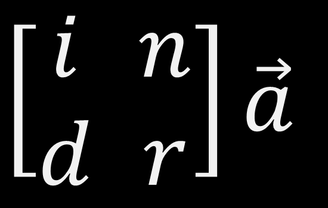

[](https://travis-ci.org/Lambda-3/Indra)
[](https://gitter.im/Lambda-3/Lobby)

# What is Indra?

Indra is an efficient library and service to delivery word-embeddings and semantic relatedness to real-world appplications in the domains of machine learning and natural language processing. It offers 60+ pre-build word-embbedings dataset in 14 languages and several model algorithms and corpora.

Indra is powered by [spotify-annoy](https://github.com/spotify/annoy) delivering an efficient [approximative nearest neughbors](http://en.wikipedia.org/wiki/Nearest_neighbor_search#Approximate_nearest_neighbor) function.

# Features

* Efficient approximative nearest neughbors (powered by [spotify-annoy](https://github.com/spotify/annoy));
* 60+ pre-build models in 14 languages;
* Permissive license for commercial use (MIT License);
* Support to [translated distributional relatedness](http://andrefreitas.org/papers/preprint_eakw_mt_2016.pdf);
* Easy deploy: Deploy the infrastructure in 3 steps;
* Access to the semantic models as a service;
* Supports multiple distributional semantic models and distance measures.

# Pre-build Models

Indra delivers ready-to-use pre-build models using different algorithms, dataset corpora and languages.
For a full list of pre-build models, please check the [Wiki](https://github.com/Lambda-3/Indra/wiki).

## Model Algorithms

* [Word2Vec (W2V)](https://en.wikipedia.org/wiki/Word2vec)
* [Global Vectors (GloVe)](https://en.wikipedia.org/wiki/GloVe_(machine_learning))
* [Explicit Semantic Analysis (ESA)](https://en.wikipedia.org/wiki/Explicit_semantic_analysis)
* [Dependency-Based Word Embeddings](http://www.aclweb.org/anthology/P14-2050)
* [Latent Semantic Analysis (LSA)](https://en.wikipedia.org/wiki/Latent_semantic_analysis)

## Supported Languages

* EN - English
* DE - German
* ES - Spanish
* FR - French
* PT - Portuguese
* IT - Italian
* SV - Swedish
* ZH - Chinese
* NL - Dutch
* RU - Russian
* KO - Korean
* JA - Japanese
* AR - Arabic
* FA - Persian

# Install

To install, please use the 3-step tool [Indra-Composed](https://github.com/Lambda-3/indra-composed).

# Getting Started

This guide provides the basic instructions to get you started using Indra. For further details, including the response format, additional parameters and the list of available models and language, please check the [Wiki](https://github.com/Lambda-3/Indra/wiki).

## Requesting Word Embeddings `(POST /vectors)`

```json
{
	"corpus": "googlenews300neg",
	"model": "W2V",
	"language": "EN",
	"terms": ["love", "mother", "santa claus"]
}
```
For further details, check the [Word Embeddings documentation](https://github.com/Lambda-3/Indra/wiki/Documentation).

## Requesting Nearest Neighbors Vectors `(POST /neighbors/vectors)`

```json
{
	"corpus": "googlenews300neg",
	"model": "W2V",
	"language": "EN",
	"topk": 10,
	"terms": ["love", "mother", "santa"]
}
```
For further details, check the [Nearest Neighbors documentation](https://github.com/Lambda-3/Indra/wiki/Documentation).

## Requesting Nearest Neighbors Relatedness `(POST /neighbors/relatedness)`

```json
{
	"corpus": "googlenews300neg",
	"model": "W2V",
	"language": "EN",
	"topk": 10,
	"scoreFunction": "COSINE",
	"terms": ["love", "mother", "santa"]
}
```
For further details, check the [Nearest Neighbors documentation](https://github.com/Lambda-3/Indra/wiki/Documentation).

## Requesting Semantic Similarity (Pair of Terms) `(POST /relatedness)`


```json
{
	"corpus": "wiki-2014",
	"model": "W2V",
	"language": "EN",
	"scoreFunction": "COSINE",
	"pairs": [{
		"t2": "love",
		"t1": "mother"
	},
	{
		"t2": "love",
		"t1": "santa claus"
	}]
}
```

For further details, check the [Semantic Similarity documentation](https://github.com/Lambda-3/Indra/wiki/Documentation).

## Requesting Semantic Similarity (One-to-Many) `(POST /relatedness/otm)`

```json
{
	"corpus": "wiki-2014",
	"model": "W2V",
	"language": "EN",
	"scoreFunction": "COSINE",
	"one" : "love",
	"many" : ["mother", "father", "child"]
}
```

For further details, check the [Semantic Similarity documentation](https://github.com/Lambda-3/Indra/wiki/Documentation).

# Translated Word Embeddings and Semantic Similarity

For __translated word embeddings__ and __translated semantic similarity__ just append _"mt" : true_ in the JSON payload.


# Public Endpoint

We have a public endpoint for demonstration only hence you can try right now with _cURL_ on the command line.

## For word embeddings:

```
curl -X POST -H "Content-Type: application/json" -d '{
	"corpus": "wiki-2014",
	"model": "W2V",
	"language": "EN",
	"terms": ["love", "mother", "santa claus"]
}' "http://indra.lambda3.org/vectors"
```

## For semantic similarity:

```
curl -X POST -H "Content-Type: application/json" -d '{
	"corpus": "wiki-2014",
	"model": "W2V",
	"language": "EN",
	"scoreFunction": "COSINE",
	"pairs": [{
		"t2": "love",
		"t1": "mother"
	},
	{
		"t2": "love",
		"t1": "santa claus"
	}]
}' "http://indra.lambda3.org/relatedness"
```

# Citing Indra

Please cite Indra, if you use it in your experiments or project.
```latex
@Inbook{Freitas2016,
author="Freitas, Andr{\'e}
and Barzegar, Siamak
and Sales, Juliano Efson
and Handschuh, Siegfried
and Davis, Brian",
editor="Blomqvist, Eva
and Ciancarini, Paolo
and Poggi, Francesco
and Vitali, Fabio",
title="Semantic Relatedness for All (Languages): A Comparative Analysis of Multilingual Semantic Relatedness Using Machine Translation",
bookTitle="Knowledge Engineering and Knowledge Management: 20th International Conference, EKAW 2016, Bologna, Italy, November 19-23, 2016, Proceedings",
year="2016",
publisher="Springer International Publishing",
address="Cham",
pages="212--222",
isbn="978-3-319-49004-5",
doi="10.1007/978-3-319-49004-5_14",
url="http://dx.doi.org/10.1007/978-3-319-49004-5_14"
}
```

# Contributors (alphabetical order)

- Andre Freitas
- Brian Davis
- Juliano Sales
- Leonardo Souza
- Siamak Barzegar
- Siegfried Handschuh
